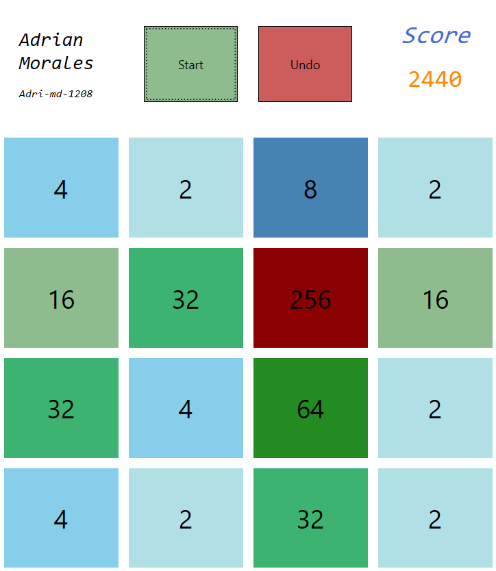

# Game-2048

The 2048 game in C# WPF in the .NET Core framework

## Tab

* [General info](#general-info)
* [Technologies](#technologies)
* [Version](#version)

## General Info

The 2048 game is a single player game that consists of adding cells together until reaching
a 2048 cell. Each match you make, increase your points in that cuantity. Enjoy playing!

## Technologies

* .NET 5.0
* .NET Core 3.1
* C# 9.0
* Visual Studio 2019 Version 16

## Version

1.0 (release)
